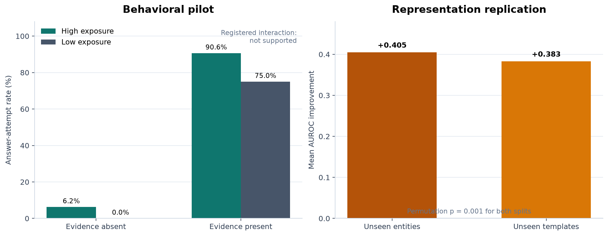
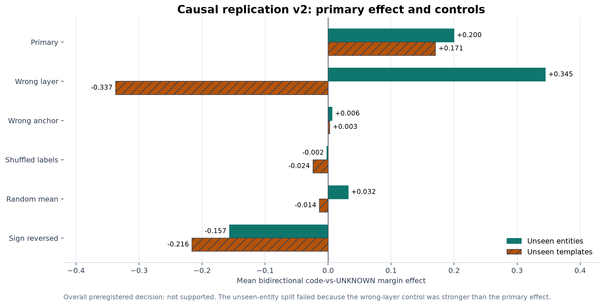

# Familiarity vs. Answerability in Language Models

**TL;DR:** We tested whether a language model confuses "I know a lot about this
entity" with "I have the evidence to answer this specific question." Across
four completed stages on `google/gemma-2-2b-it`, the model did **not** show the
predicted confusion behaviorally, but its internal activations **did** encode
answerability beyond a simple word-statistics baseline. Two causal studies then
found that the decoded direction can shift an internal response margin, but did
not establish a robust, layer-specific mechanism.

| Stage | Question | Result |
|---|---|---|
| 1. Behavioral | Does unrelated exposure increase unsupported answer attempts? | **Not supported** |
| 2. Representation | Do internal activations predict answerability beyond a bag-of-ngrams baseline? | **Supported on this controlled task** |
| 3. Causal pilot v1 | Does the decoded direction causally shift the model's response margin? | **Not evaluable** after a control defect |
| 4. Causal replication v2 | Does the corrected intervention beat every control on fresh entities and templates? | **Mixed split evidence; overall not supported** |

These results are consistent rather than contradictory. The model did not
*behave* as if familiarity were answerability. Its activations nevertheless
contained decodable answerability information, and steering that information
changed an internal probability margin without producing a reliable behavioral
correction.



*Figure 1. Left: the behavioral pilot did not support the predicted exposure
effect. Right: fixed activation probes outperformed the registered TF-IDF
baseline on held-out entities and templates.*

---

## 1. The Question, in Plain English

Can a model tell the difference between:

- **Familiarity:** having seen a lot of unrelated context about something; and
- **Answerability:** having the specific evidence needed to answer a question?

If a model conflates the two, it might confidently guess when it should
abstain. That would be a reliability problem for systems expected to recognize
when the available evidence is insufficient.

## 2. Experimental Design

Every experimental unit uses **the same target string** across four conditions,
varying only exposure and evidence:

| | Evidence present | Evidence absent |
|---|---|---|
| **High exposure** | Unrelated facts about the target, then its archive code | Unrelated facts, no archive code |
| **Low exposure** | Matched context elsewhere, then the archive code | Matched context elsewhere, no archive code |

Holding the target string fixed, the **Same-String control**, removes a major
confound: a familiar-looking name should not be easier merely because of its
spelling or tokenization. The design isolates exposure and evidence across full
experimental units rather than a few selected prompts.

## 3. Results

### 3.1 Behavioral pilot: the predicted failure did not appear

**Setup:** 32 preregistered units x 4 conditions = 128 complete and validly
formatted model responses.

| Exposure | Evidence | Answer-attempt rate |
|---|---|---:|
| High | Absent | 6.25% |
| Low | Absent | 0.00% |
| High | Present | 90.63% |
| Low | Present | 75.00% |

When evidence was absent, the model almost always abstained regardless of
exposure. The registered exposure-by-answerability interaction was `-0.094`
(95% bootstrap CI `[-0.40, 0.18]`). Because the interval crosses zero, the
registered decision is **`not_supported`**.

The absent-evidence cells contained only 2/32 and 0/32 answer attempts. They are
too sparse to rule out a small effect. This is therefore a limited negative
result on one small model and a synthetic task, not proof that familiarity
never matters.

[Read the behavioral report](docs/results/same_string_feasibility_v2_behavior_result.md)
or inspect the
[machine-readable result](docs/results/same_string_feasibility_v2_behavior_result.json).

### 3.2 Representation replication: answerability was decodable internally

**Setup:** 80 units x 4 conditions = 320 prompts, divided into 32 training, 8
validation, 20 unseen-entity test, and 20 unseen-template test units.

| Test split | Units | Log-loss improvement | 95% CI | AUROC improvement | Permutation p |
|---|---:|---:|---:|---:|---:|
| Unseen entities | 20 | 0.472 | [0.359, 0.547] | 0.405 | 0.001 |
| Unseen templates | 20 | 0.303 | [0.088, 0.475] | 0.383 | 0.001 |

The registered TF-IDF baseline stayed at chance (`AUROC = 0.50`) on both
splits. Fixed residual-stream activations predicted answerability well above
chance, including for entities and prompt templates the probe never saw during
training. A pre-evidence control, measured before the answer-relevant token
appeared, also stayed at chance.

The answerability signal was explicitly present in the prompt, so a symbolic
parser could solve the task. The result is about **internal representation and
held-out decodability**, not hidden knowledge. Its value is the controlled
transfer beyond the registered word-statistics baseline, not the claim that
prompt-final activations contain prompt information.

[Read the representation report](release/familiarity_answerability/representation_replication_v3/analysis/result.md)
or inspect the
[machine-readable result](release/familiarity_answerability/representation_replication_v3/analysis/result.json).

### 3.3 Causal pilot v1: completed, but not confirmatory

We tested whether the training-derived answerability direction could change the
model's preference between returning the correct archive code and returning
`UNKNOWN`. The intervention shifted this internal probability margin, but did
not change any of the model's 144 primary-versus-baseline final answers. It also
failed to outperform the strongest registered controls.

A post-run audit then found that the required label-shuffled control was
bit-for-bit identical to the primary direction. The shuffle had preserved the
same mathematical mean, so it was not an independent null control. The frozen
machine result remains **`not_supported`**, but the correct confirmatory status
is **`not_evaluable`** because the control was invalid.

We preserved and reported the failed run rather than repairing it after seeing
the result. The opened test units were not reused to claim confirmation.

[Open the v1 Colab notebook](notebooks/fa_answerability_causal_pilot_colab.ipynb),
[read the post-run audit](release/familiarity_answerability/answerability_causal_pilot_v1/POST_RUN_AUDIT.md),
or inspect the
[frozen machine result](release/familiarity_answerability/answerability_causal_pilot_v1/results/result.md).

### 3.4 Causal replication v2: a real margin effect, but not a robust layer-specific mechanism

The corrected replication used fresh entities and templates, a genuinely
independent balanced label-shuffle control, and the same frozen intervention
layer. All 432 primary and control receipts completed and passed the independent
hash and provenance audit.

The intervention shifted the predicted response margin on both test splits:

- **Unseen entities:** primary effect `0.1997`, but the wrong-layer control was
  larger at `0.3448`.
- **Unseen templates:** primary effect `0.1705` and larger than every registered
  control.

One split passed and one failed. Because the preregistration required both
splits to pass independently, the overall result is **`not_supported`**. The
intervention also changed only 1 of 144 primary-versus-baseline final outputs.



*Figure 2. The decoded direction shifted the registered response margin on both
splits. The stronger wrong-layer effect on unseen entities prevents a robust
layer-specific causal interpretation.*

The narrow conclusion is that the decoded direction can causally steer an
internal response margin on this task. The study does **not** establish that
layer 18 uniquely implements answerability or that the intervention reliably
corrects model behavior.

[Open the v2 Colab notebook](notebooks/fa_answerability_causal_replication_v2_colab.ipynb),
[read the independent post-run audit](release/familiarity_answerability/answerability_causal_replication_v2/POST_RUN_AUDIT.md),
or inspect the
[frozen v2 result](release/familiarity_answerability/answerability_causal_replication_v2/results/result.md).

## 4. What This Does and Does Not Establish

**Supported by the completed evidence:**

- The behavioral pilot did not show the predicted familiarity-driven increase
  in unsupported answers.
- Fixed activations predicted answerability beyond the registered
  bag-of-ngrams baseline on unseen entities and templates.
- The training-derived direction shifted the model's code-versus-`UNKNOWN`
  probability margin on fresh controlled prompts.

**Not established:**

- a general mechanism of familiarity or hallucination;
- metacognition, human-like knowledge, or intuition;
- a robust, layer-specific answerability mechanism;
- information not already present in the prompt;
- generalization beyond this task or model; or
- a working hallucination detector or correction method.

## 5. Why This Matters

Two downstream concerns make the distinction between familiarity and evidence
sufficiency consequential.

**Reliability and abstention.** A model that treats "this feels familiar" as
"I have the evidence" would be unreliable where abstention matters most. This
study did not find that failure mode behaviorally. It did find that the model's
internal state tracks the relevant distinction, which is a useful prerequisite
for future work on evidence-aware abstention and uncertainty monitoring. It is
not itself such a method.

**A necessary upstream condition for formal verification.** Before LLM
reasoning can be reliably subjected to formal verification, there is an
important upstream question: does the model distinguish between information it
merely recognizes as familiar and evidence that actually supports a conclusion?
If a model cannot reliably make this distinction, a formalized reasoning chain
may encode unsupported assumptions as premises and still yield a formally valid
but unsound proof, because proof assistants check the validity of inference,
not the truth of premises. This project therefore investigates whether evidence
sufficiency is represented internally and can be measured independently of
simple lexical familiarity. The results provide methodological groundwork for a
subsequent question: how reliably can an LLM translate natural-language
evidence and reasoning into an explicit formal representation whose individual
steps can then be verified by systems such as Lean 4. This study does not test
that translation itself; it isolates one upstream condition that such a
verification pipeline would depend on. On this controlled task, that condition
held behaviorally — the model did not confuse exposure with evidence — while
representation-level measurement succeeded and reliable causal control remains
open. The distance between archive-code prompts and genuine premise-evidence
relations in multi-step arguments remains substantial; closing it with natural
factual questions is registered as a next step in Section 7.

## 6. Research Standards

- Hypotheses and decision rules were frozen before protected outcomes opened.
- Model revision, prompts, parser, seeds, and thresholds are hash-bound.
- Training, validation, and test units are strictly separated.
- Protected endpoints open once and fail closed on incomplete evidence.
- Negative and `not_evaluable` outcomes remain in the public record.
- The invalid v1 control was disclosed; v2 used fresh units and a corrected
  control rather than retroactively rescuing v1.
- The behavioral snapshot lacks its pre-outcome power/MDE artifact, so its null
  result remains an imprecise pilot rather than a definitive negative finding.

## 7. Limitations and Fellowship-Scale Next Steps

The highest-value continuation would:

1. compare the activation probe with an explicit binding parser as a transparent task-solving baseline;
2. replicate on a second, larger model family;
3. replace archive-code prompts with natural factual and evidence-grounded questions while retaining matched answerability controls;
4. increase the number of unseen entities and templates and publish power analysis before opening outcomes;
5. test multiple seeds;
6. map where the direction transfers across layers before making a layer-specific mechanistic claim; and
7. cross-check the decoded direction against pretrained Gemma Scope SAE features on the same activations, to see whether it aligns with an existing interpretable feature rather than training a new SAE from scratch.

The current project was intentionally scoped for an 8 GB local machine and free-tier Colab compute. Local hardware handled tests, audits, analysis, and reporting; Colab handled pinned Gemma generation and activation extraction.

## Research Agenda

A fellowship-scale continuation of this work is sketched in [the research agenda](docs/research_agenda.md): coupling step-wise Lean 4 verification to internally decoded evidence-sufficiency signals, both as an inference-time premise monitor and as a candidate process-reward signal during RL fine-tuning. The agenda positions itself against established verifier-in-the-loop proving and process-reward models, states its schedule risks (including corpus-construction time), defines three preregistered milestones with a fallback, and carries the completed study's claim boundaries forward unchanged.

## Why not SAEs or TransformerLens?

The causal question this project asked, whether a decoded direction in the residual stream shifts the model's response margin, was tested directly through activation steering. That is a direct causal intervention on the representation itself, not a preliminary step before "real" mechanistic work. It let the project establish, with minimal dependencies and full hash-bound auditability, that the effect exists but is not robustly layer-specific.
SAE-based feature decomposition would add a further layer of granularity, checking whether the effect localizes to a single interpretable feature or reflects a distributed combination, but it was not treated as a prerequisite for the causal test itself.
Initially, training or applying an SAE was assumed to be out of reach given the local compute budget, which factored into deferring that decomposition. Further research showed this assumption was overly conservative: pretrained SAEs already exist for Gemma-2-2B (e.g. Gemma Scope), so a future pass could run this decomposition using inference only. That is scoped as a follow-up rather than this submission.

## 8. Reproduce

Use Python 3.12:

```bash
git clone https://github.com/Fredo220/Answerability-x-Familarity-.git
cd Answerability-x-Familarity-

python3.12 -m venv .venv
source .venv/bin/activate
python -m pip install -r requirements/fa-core.lock
python -m pip install --no-deps -e .
python -m pytest -q \
  tests/test_fa_data.py \
  tests/test_fa_scoring.py \
  tests/test_fa_cli.py \
  tests/test_fa_notebooks.py \
  -k "same_string or notebook"
```

Local hardware is sufficient for tests, audits, analysis, and reporting.
Regenerating Gemma outputs and activations requires a suitable Colab GPU and a
Hugging Face token stored through Colab Secrets. Never paste or commit access
tokens.

Regenerate the README figures from the published result files with:

```bash
python tools/plot_readme_summary.py
python tools/plot_causal_replication_v2.py
```

## Acknowledgments

**Sameh Aburadi** provided independent execution and quality-control support:
assistance with the pinned Gemma/Colab runs and artifact review, candidate and
ground-truth quality checks, human-rating and audit materials, and identifying
ambiguity, granularity, and alias defects in the evaluated corpus. This work
helped prevent instrument problems from being misreported as evidence about the
research hypothesis.

## Key Evidence

| Artifact | Purpose |
|---|---|
| [Behavioral amendment](docs/amendments/2026-08-01-fa-same-string-balanced-pilot-v2.md) | Frozen behavioral design and decision rule |
| [Behavioral result](docs/results/same_string_feasibility_v2_behavior_result.md) | Human-readable behavioral outcome |
| [Representation result](release/familiarity_answerability/representation_replication_v3/analysis/result.md) | Held-out representation replication |
| [Causal v1 result](release/familiarity_answerability/answerability_causal_pilot_v1/results/result.md) | Frozen v1 evaluator output |
| [Causal v1 audit](release/familiarity_answerability/answerability_causal_pilot_v1/POST_RUN_AUDIT.md) | Invalid control and final claim boundary |
| [Causal v2 preregistration](docs/familiarity_answerability_causal_replication_v2_preregistration.md) | Corrected replication design and decision rule |
| [Causal v2 result](release/familiarity_answerability/answerability_causal_replication_v2/results/result.md) | Fresh-unit v2 evaluator output |
| [Causal v2 audit](release/familiarity_answerability/answerability_causal_replication_v2/POST_RUN_AUDIT.md) | Receipt, control, preservation, and result audit |
| [Claim boundaries](docs/familiarity_answerability_claims.md) | Registered limits on interpretation |

<details>
<summary><strong>Technical history and preserved failed instruments</strong></summary>

Earlier real-entity corpus attempts (Source-v5 and R9-R11) and Same-String v1
failed their registered readiness gates before producing usable confirmatory
evidence. These failures concern measurement readiness, not the research
hypothesis, and remain public for auditability.

- [R11 outcome report](docs/results/source_v6_r11_instrument_development_outcome.md)
- [Same-String v1 runbook](docs/fa_same_string_primary_runbook.md)
- [Original preregistration](docs/familiarity_answerability_preregistration.md)
- [Historical amendments](docs/amendments)
- [Historical results](docs/results)

</details>
