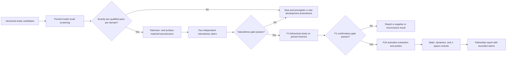

# Familiarity vs. Answerability Architecture Map

## Purpose

Graphify is used here as a local code-navigation and dependency-audit tool. It
does not provide mechanistic evidence about the language model and is not an
experimental endpoint.

The graph is deliberately limited to:

- `src/trajectory_extractor/fa_*.py`
- `tests/test_fa_*.py`
- `src/trajectory_extractor/__init__.py`

This prevents archived RLMF, jailbreak, Remizov, and concept-mixing tracks from
being conflated with the active Familiarity-vs-Answerability study.

## Research Flow



## Claim Boundary

The confirmatory question is whether entity familiarity changes answer attempts
when the requested relation is absent from context, after controlling for
answerability and surface form. F2A may test whether internal activations contain
incremental predictive information about that behavior.

The study does not claim to measure general truth, metacognition, artificial
intuition, jailbreak risk, or a universal hallucination mechanism.

## Build

The graph is built with the pinned, isolated Graphify package and local AST
parsing only:

```bash
tools/build_fa_graph.sh --force
```

No source code or research data is sent to an external model. Generated outputs
are written to `graphify-out/`.

Useful queries:

```bash
uvx --from graphifyy==0.9.25 graphify god-nodes \
  --graph graphify-out/graph.json
uvx --from graphifyy==0.9.25 graphify query \
  "How does entity screening gate pilot construction?" \
  --graph graphify-out/graph.json
uvx --from graphifyy==0.9.25 graphify query \
  "Which code paths enforce confirmatory leakage controls?" \
  --graph graphify-out/graph.json
```

## Interpretation Rules

1. `EXTRACTED` edges reflect explicit code structure.
2. `INFERRED` edges are navigation hypotheses and require source verification.
3. Graph centrality is not scientific importance.
4. Graphify output cannot select hypotheses, layers, thresholds, or claims.
5. The graph must be rebuilt when FA code changes.
