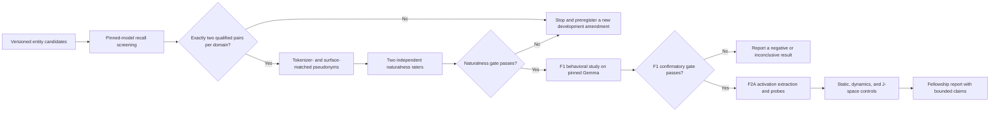

# Familiarity vs. Answerability Architecture Map

## Purpose

This document maps the active study pipeline and its evidence boundaries. It
does not provide mechanistic evidence by itself and is not an experimental
endpoint.

## Research Flow

## Claim Boundary

The confirmatory question is whether entity familiarity changes answer attempts
when the requested relation is absent from context, after controlling for
answerability and surface form. F2A may test whether internal activations contain
incremental predictive information about that behavior.

The study does not claim to measure general truth, metacognition, artificial
intuition, or a universal hallucination mechanism.
